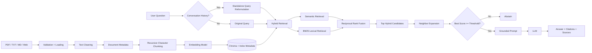

# DocuMind — RAG Chatbot with LangChain

A Retrieval-Augmented Generation (RAG) chatbot that answers questions using retrieved passages from user-provided documents rather than relying solely on general model knowledge.

**Supported sources:**

- PDF
- TXT
- Markdown
- Web pages

The application uses **LangChain, Chroma, Streamlit, local HuggingFace embeddings**, and pluggable LLM and embedding providers.

---

## Live Demo

**Streamlit Cloud:**  
> [https://documind-rag-chatbot-fwu4hg6gps85maecsmnyik.streamlit.app/]

---

## Features

- **Multi-source ingestion** — PDF, TXT, Markdown, and web pages with file, count, size, and URL validation.
- **Persistent knowledge base** — Chroma uses a deterministic collection that survives application restarts.
- **Embedding compatibility checks** — persisted indexes record embedding configuration and reject incompatible reloads.
- **Hybrid retrieval** — combines semantic similarity retrieval with BM25 lexical retrieval using Reciprocal Rank Fusion (RRF).
- **Neighbor expansion** — optionally includes nearby chunks from the same source document to preserve local context.
- **Relevance-based abstention** — weak retrieval results can cause the chatbot to abstain instead of generating from poor context.
- **Multi-turn chat** — follow-up questions are reformulated into standalone retrieval queries.
- **Source citations** — answers reference retrieved source chunks using numbered citations.
- **Source display** — retrieved source chunks show file/page or web-source metadata.
- **Provider abstraction** — Groq, OpenAI, and Ollama for chat; HuggingFace, OpenAI, and Ollama for embeddings.
- **Streaming responses** — generated answers are streamed through the Streamlit interface.
- **Optional retrieval diagnostics** — rewritten query, retrieval scores, threshold, and latency can be displayed.
- **Configuration validation** — invalid configuration values raise explicit configuration errors.

---

## Architecture



### Module responsibilities

| Stage | Module | Responsibility |
|---|---|---|
| Ingestion | `src/ingestion.py` | Validate, load, clean, assign metadata, and chunk documents |
| Indexing + Retrieval | `src/vectorstore.py` | Build, persist, reload, validate, and perform semantic/BM25 hybrid retrieval |
| Providers | `src/llm_factory.py` | Create LLM and embedding provider instances |
| Retrieval + generation | `src/rag_chain.py` | Reformulate queries, retrieve, abstain, and generate answers |
| Interface | `app.py` | Streamlit UI and application orchestration |
| Errors | `src/exceptions.py` | Shared typed application exceptions |

## Project structure

```text
rag-chatbot/
├── app.py
├── config.py
├── requirements.txt
├── .env.example
├── README.md
├── PROBLEM_DOMAIN.md
├── data/
│   └── .gitkeep
└── src/
    ├── __init__.py
    ├── exceptions.py
    ├── ingestion.py
    ├── vectorstore.py
    ├── llm_factory.py
    └── rag_chain.py
```

## Setup

### 1. Prerequisites

- Python 3.11+
- A configured chat provider:
  - Groq
  - OpenAI
  - Ollama

The default configuration uses:

```text
LLM_PROVIDER=groq
EMBEDDING_PROVIDER=huggingface
```

The default embedding model is:

```text
sentence-transformers/all-MiniLM-L6-v2
```

This runs locally and may require a relatively large PyTorch installation.

### 2. Create the environment

```bash
python -m venv venv
```

Windows:

```powershell
venv\Scripts\activate
```

Linux/macOS:

```bash
source venv/bin/activate
```

Install dependencies:

```bash
python -m pip install --upgrade pip
pip install -r requirements.txt
```

### 3. Configure environment variables

Copy the example file:

```bash
cp .env.example .env
```

Windows PowerShell:

```powershell
Copy-Item .env.example .env
```

Configure the required provider settings in `.env`.

Example:

```env
LLM_PROVIDER=groq
GROQ_API_KEY=your_key_here

EMBEDDING_PROVIDER=huggingface
HUGGINGFACE_EMBEDDING_MODEL=sentence-transformers/all-MiniLM-L6-v2
```

Provider API keys may also be entered through the Streamlit interface.

### 4. Run the application

```bash
streamlit run app.py
```

The application normally opens at:

```text
http://localhost:8501
```

## Using the application

### Build the knowledge base

1. Upload PDF, TXT, or Markdown files, and/or provide web URLs.
2. Click **Build knowledge base**.
3. The application validates and loads the sources.
4. Documents are cleaned and chunked.
5. Embeddings are generated.
6. Chunks are persisted into the configured Chroma collection.

A rebuild replaces the existing deterministic collection.

### Ask questions

Enter a question in the chat interface.

The retrieval pipeline:

```text
Question
   ↓
History-aware reformulation
   ↓
 ┌─────────────────────────────┐
 │                             │
Semantic Retrieval        BM25 Retrieval
 │                             │
 └──────────────┬──────────────┘
                ↓
     Reciprocal Rank Fusion
                ↓
       Hybrid Ranked Results
                ↓
        Neighbor Expansion
                ↓
        Relevance Check
                ↓
        Grounded Prompt
                ↓
               LLM
                ↓
     Answer + Retrieved Sources```

Follow-up questions can use previous conversation context.

## Persistence and embedding compatibility

The Chroma collection is persisted to:

```text
./chroma_db
```

by default.

The application records index metadata alongside the collection, including:

- embedding provider
- embedding model
- chunk size
- chunk overlap
- collection name
- index version

When an existing index is reloaded, incompatible embedding configuration is rejected rather than silently reused.

Changing the **chat model** does not require re-indexing.

Changing the **embedding provider or embedding model** requires rebuilding the knowledge base.

## Relevance threshold

The default retrieval threshold is:

```text
0.2
```

This is a starting value, not a validated optimum.

The relevance score is derived from the cosine-distance configuration used by the Chroma collection.

Enable retrieval diagnostics to inspect:

- reformulated query
- retrieved scores
- threshold
- retrieval latency
- generation latency
- abstention decision

Use real answerable and unanswerable questions to calibrate the threshold before treating it as an empirically validated value.

The abstention gate can also be disabled.

## Configuration reference

| Variable | Default | Purpose |
|---|---|---|
| `LLM_PROVIDER` | `groq` | Chat provider |
| `EMBEDDING_PROVIDER` | `huggingface` | Embedding provider |
| `CHUNK_SIZE` | `1000` | Chunk size in characters |
| `CHUNK_OVERLAP` | `150` | Character overlap |
| `RETRIEVER_K` | `4` | Number of retrieved chunks |
| `RETRIEVAL_SCORE_THRESHOLD` | `0.2` | Relevance abstention threshold |
| `MAX_HISTORY_TURNS` | `6` | Conversation turns retained |
| `MAX_UPLOAD_SIZE_MB` | `20` | Maximum individual upload size |
| `MAX_UPLOAD_FILES` | `10` | Maximum files per upload batch |
| `CHROMA_PERSIST_DIR` | `./chroma_db` | Persistent Chroma location |
| `CHROMA_COLLECTION_NAME` | `rag_chatbot` | Stable Chroma collection |
| `INDEX_VERSION` | `1` | Index compatibility version |
| `ENABLE_RETRIEVAL_DIAGNOSTICS` | `false` | Diagnostic UI |

## Design decisions

### LCEL

The application uses explicit LangChain Expression Language pipelines:

```python
prompt | llm | StrOutputParser()
```

This keeps query reformulation and answer generation explicit and avoids unnecessary framework complexity.

### Stable Chroma collection

The application uses one deterministic collection instead of generating random collection names for every rebuild.

For this single-user application:

```text
Build = replace existing knowledge base
```

This makes restart behavior deterministic.

### Embedding compatibility

Vectors are meaningful only within the embedding space that created them.

The persisted metadata therefore records the provider and model and verifies them before reload.

### Cosine similarity

The collection is created with cosine space so the retrieval layer can derive:

```text
relevance = 1 - distance
```

and use that score for diagnostics and threshold-based abstention.

### History-aware retrieval

Follow-up questions such as:

```text
What about the second one?
```

can be ambiguous without conversation history.

The application therefore reformulates follow-up questions into standalone retrieval queries before searching the vector store.

### Provider separation

LLM and embedding providers are intentionally independent.

For example:

```text
Groq chat
+
local HuggingFace embeddings
```

is a supported configuration.

### Chunking

Documents use `RecursiveCharacterTextSplitter`.

Default values:

```text
chunk_size = 1000
chunk_overlap = 150
```

The implementation uses character-based chunking rather than token-aware chunking.

Each chunk receives stable metadata including:

```text
document_id
chunk_id
source
source_type
display_source
```

## Troubleshooting

### Embedding mismatch

An error indicating different embedding spaces means the persisted index was created with a different embedding configuration.

Rebuild the knowledge base using the current embedding provider/model.

### Missing API key

For Groq or OpenAI, provide the appropriate API key through:

- `.env`, or
- the Streamlit sidebar

### Embedding model installation problems

The default HuggingFace embedding model uses the local `sentence-transformers` stack.

On constrained machines, consider Ollama or an API-based embedding provider instead.

### Ollama connection errors

Ensure Ollama is running and the selected model is available locally.

Example:

```bash
ollama pull llama3.1
```

### Configuration errors

Configuration is validated during import.

Examples include:

```text
CHUNK_OVERLAP >= CHUNK_SIZE
RETRIEVER_K <= 0
MAX_UPLOAD_FILES <= 0
invalid provider names
invalid retrieval threshold
```

The resulting error identifies the invalid configuration value.